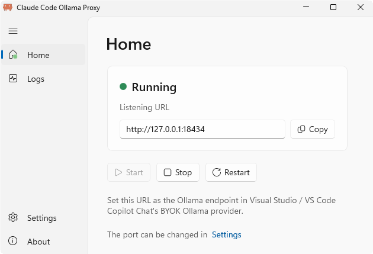
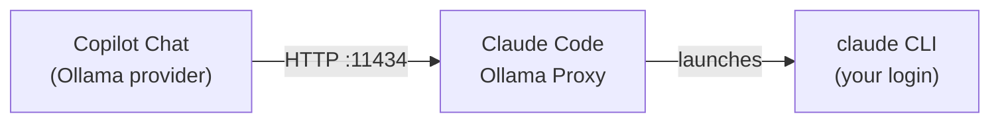
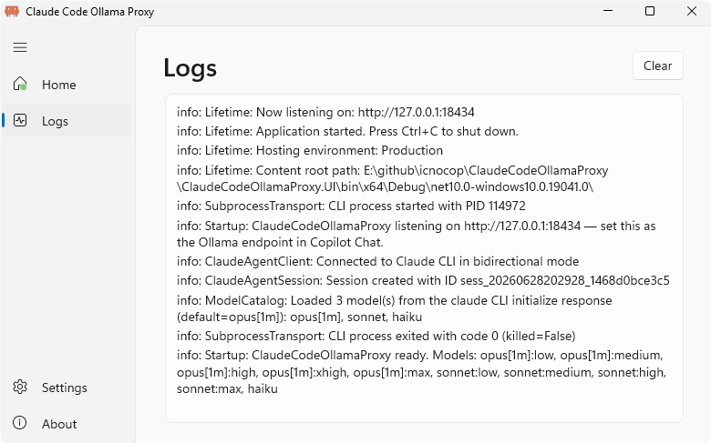
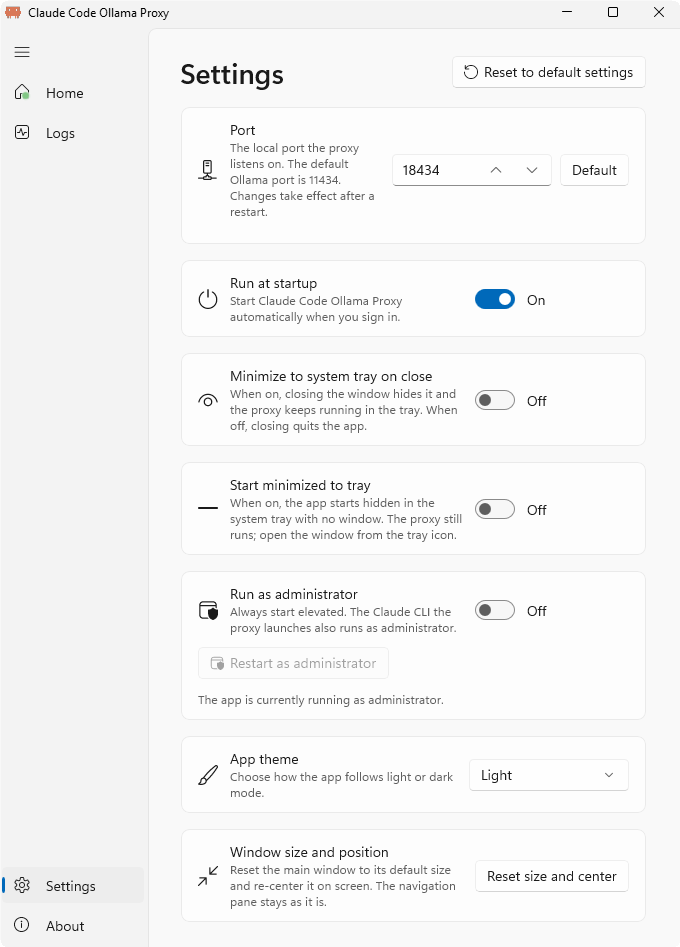

# Claude Code Ollama Proxy

Use **Claude Code** inside Visual Studio / VS Code **GitHub Copilot Chat** — including Copilot's native
diff / Accept-Reject UI — with no extra extension. The app runs a local server that implements the
**Ollama API** and drives your existing **Claude Code CLI** login.

  <picture>
    <source media="(prefers-color-scheme: dark)" srcset="docs/screenshots/home-dark.png">
    
  </picture>

## How it works

## Getting started

1. Install the **Claude Code CLI** and sign in (`claude login`).
2. Run the console or tray app — it serves on `http://127.0.0.1:11434`.
3. In Copilot Chat, add an **Ollama** provider pointed at `http://127.0.0.1:11434`, then pick a
   `claude-*` model. Switch to **Agent** mode to let Claude edit files.

📷 More screenshots

### Logs
<picture>
  <source media="(prefers-color-scheme: dark)" srcset="docs/screenshots/logs-dark.png">
  
</picture>

### Settings
<picture>
  <source media="(prefers-color-scheme: dark)" srcset="docs/screenshots/settings-dark.png">
  
</picture>

## Features

**Main window**

- 🟢 **Home** — start / stop / restart the proxy, see live status, and copy the listening URL.
- 📜 **Logs** — watch the proxy's live log output in-app.
- ⚙️ **Settings** — change the port, pick a theme (System / Light / Dark), run at startup, run as
  administrator, choose whether closing minimizes to tray, start minimized to the tray, and reset the
  window size or all settings.
- ℹ️ **About** — version info and a link to the project page.

**System-tray icon**

- 🎨 **Live status glyph** — the tray (and taskbar / title-bar) icon shows a status dot that changes
  color with the proxy state.
- 💬 **Tooltip** — hover to see the running state and listening URL.
- 🖱️ **Single click** — opens the main window.

**Tray right-click menu**

- 🪟 **Open** — show the main window.
- 📋 **Copy URL** — copy the current listening URL (shown inline in the menu).
- ▶️ **Start** / ⏹️ **Stop** / 🔄 **Restart** — control the proxy without opening the window
  (enabled to match the current state).
- ❌ **Quit** — fully exit the app (closing the window keeps it running in the tray).

**Reliability**

- 🛡️ Fault-tolerant logging and global exception handlers with crash logging keep the app running and
  capture failures for diagnosis.

## Documentation

- [How it works](docs/how-it-works.md) · [The tool-call bridge](docs/tool-call-bridge.md)
- [Visual Studio setup](docs/visual-studio-setup.md) · [Effort levels](docs/effort-levels.md)
- [Configuration](docs/configuration.md) · [Logging](docs/logging.md) · [Image input](docs/image-input.md)
- [Troubleshooting](docs/troubleshooting.md) · [Limitations](docs/limitations.md) · [References](docs/references.md)
- [Development](DEVELOPMENT.md) — build, run, and test from source

## License

See [LICENSE.txt](LICENSE.txt).
